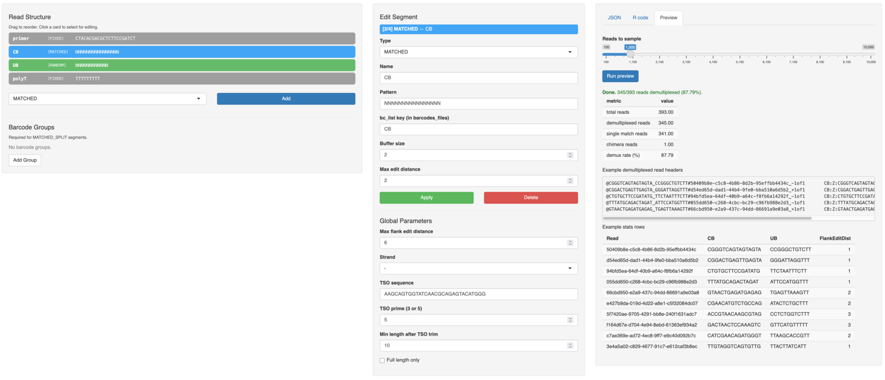

# flexiplexR

R port of [flexiplex](https://davidsongroup.github.io/flexiplex/), with GUI barcode specification and demultiplex rate preview.

## Interactive designer

`run_barcode_designer()` launches a Shiny GUI for drag-and-drop construction of read structures, with a live preview that demultiplexes the first N reads of a FASTQ.

```r
run_barcode_designer(fastq = "reads.fq.gz", barcodes_files = c(CB = "barcodes_allow.tsv.gz"))
```



## Install

```r
# install.packages("devtools")
devtools::install_github("ChangqingW/flexiplexR")
```

Requires a C++17 compiler and `Rhtslib`. On Bioconductor-supported platforms (Linux/macOS) the package builds with `R CMD INSTALL`.

## Quick start

```r
library(flexiplexR)

# Define a 10x 3' v3 read structure
segments <- list(
  barcode_segment("FIXED",   "CTACACGACGCTCTTCCGATCT", "primer"),
  barcode_segment("MATCHED", strrep("N", 16),          "CB",  bc_list = "CB"),
  barcode_segment("RANDOM",  strrep("N", 12),          "UB"),
  barcode_segment("FIXED",   strrep("T", 9),           "polyT")
)

find_barcode(
  fastq          = "reads.fq.gz",
  segments       = segments,
  barcodes_files = c(CB = "barcodes_allow.tsv.gz"),
  reads_out      = "matched_reads.fq.gz",
  stats_out      = "stats.tsv"
)

# Or configure Interactively in a browser:

res <- run_barcode_designer()
find_barcode(fastq = "reads.fq.gz", segments = res$segments, barcodes_files = "barcodes_allow.tsv.gz", ...)


# Or load a JSON config:

cfg <- read_barcode_config(system.file("extdata", "config_sclr_nanopore_3end.json", package = "flexiplexR"))
find_barcode(fastq = "reads.fq.gz", segments = cfg$segments, barcodes_files = "barcodes_allow.tsv.gz", ...)
```
